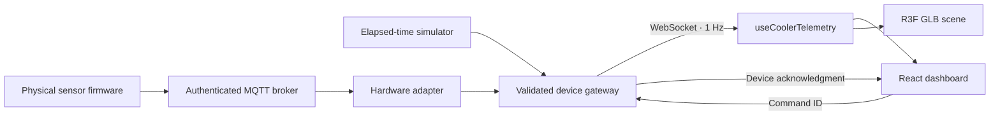

# Cooler Studio

A complete React 19 + React Three Fiber digital twin of an Imbera/Coca-Cola style single-door beverage merchandiser. The app is isolated from the surrounding Connected Enterprise project; it has its own dependencies, build and server.

## Run locally

Requires Node.js 22.12+ (or 20.19+) and npm. From this directory:

```powershell
npm ci
npm run dev
```

Open **http://127.0.0.1:5180**. This starts Vite and the telemetry service on port 3002 together. All fonts, the studio HDR and the Draco decoder are local assets. No account or API key is required.

For the compiled application on one origin:

```powershell
npm run build
npm start
```

Open **http://127.0.0.1:3002**. Stop the development command before starting another server on port 3002. `npm run preview` is also available on port 4173, with its telemetry proxy pointing to a separately running service on 3002.

## Explore

- Drag to orbit, scroll to zoom, or use the camera toolbar. Expand the scene for a closer look.
- Click the door or **Open door**. Its left hinge animates through 110°, and server-confirmed state drives both the model and thermal simulation.
- Click the compressor, shelves or thermostat to inspect components. The thermostat’s physical display and floating sensor badges update with the stream.
- Open **Cooler controls** to apply a 2–6°C thermostat set point or reset the simulation.
- Click any of the 40 inventory slots to remove or replenish a lane. The corresponding bottles/cans disappear from or return to the GLB scene.
- Switch between Overview, Diagnostics and Inventory. Temperature history contains only packets received during this browser session; it starts empty.
- Export the current payload and up to 300 history packets as JSON, or capture the WebGL view as a PNG. PNG export captures the 3D render, without the HTML dashboard or HTML sensor badges.
- Toggle sensor labels or select **Component map** for a material-based component guide. This view is not a thermographic measurement.

The frontend explicitly shows simulation/hardware mode and stale/disconnected state. Commands wait for acknowledgment, fail visibly on timeout, and are disabled without fresh telemetry. The simulator uses elapsed time rather than browser frame count. Live hardware controls are disabled in this demonstration UI; enable and authorize a device command adapter during commissioning.

## Code map

| File | Responsibility |
| --- | --- |
| `src/App.tsx` | Responsive charcoal/red workspace, charts, inventory, diagnostics, controls and export |
| `src/CoolerScene.tsx` | R3F Canvas, local GLB/HDR loading, three-point/interior lighting, GSAP hinge, stock visibility, hover/click handling, Html HUD |
| `src/useCoolerTelemetry.ts` | Schema validation, WebSocket subscription, fresh/stale status, backoff, bounded history and acknowledged commands |
| `src/styles.css` | Responsive layout, local typography, accessible focus and reduced-motion styling |
| `shared/telemetry.ts` | Versioned Zod schemas and TypeScript wire types |
| `server/simulator.ts` | Three-zone air/humidity model, hysteresis, diagnostics, inventory, runtime and energy |
| `server/service.ts` | Express/HTTP, WebSocket transport, heartbeat, validation, backpressure and compiled frontend |
| `server/hardware.ts` | MQTT source with device/schema/time validation and device acknowledgment boundary |
| `assets/build_cooler.py` | Reproducible Blender modeling, actual Cycles AO bake and Draco export |
| `assets/cooler.blend` | Editable Blender source |
| `public/models/cooler.glb` | Final 1.14 MB asset, 98,349 triangles, 40 stock lanes and a separate hinged door |
| `docs/RESEARCH.md` | Manufacturer references, telemetry analysis, current libraries and production design |

## Architecture



Choose exactly one source with `TELEMETRY_SOURCE`; hardware mode does not silently substitute synthetic readings. Copy `server/.env.example` to `.env` in this directory to configure the service. MQTT telemetry and command/ack topics, source contracts and deployment guidance are described in [server/README.md](server/README.md).

For a fleet, partition device gateways by device ID, retain the versioned schema, and persist telemetry in a time-series store behind the broker. Browser sessions subscribe to authorized device channels. The shipped server is one asset per process and keeps simulator state in memory; it is a working device gateway, not a deployed fleet platform. Public deployment requires TLS, authenticated device/user access, broker ACLs and operational storage. None of those credentials or infrastructure are assumed to exist.

## Asset pipeline

The model was generated with **Blender 4.5.13 LTS**, with bevels, contoured bottles/cans, wire shelves, lane dividers, internal light diffusers, gasket, handle, vent louvers and raised branding. PBR materials include clearcoat, transmission and emissive channels. A genuine 1024² Cycles AO atlas is connected to glTF occlusion channels. Draco compresses all 201 material primitives. The scene uses on-demand rendering and caps pixel ratio at 1.6; it does not rebuild the model on sensor updates.

```powershell
blender -b -t 8 -P assets/build_cooler.py
python assets/validate_asset.py
```

See [assets/README.md](assets/README.md) for node names, coordinates, rendering commands and provenance. `npx gltfjsx public/models/cooler.glb` can generate an alternate component; preserve semantic node names when optimizing.

## Verification

```powershell
npm run build
npm test
python assets/validate_asset.py
```

The automated suite covers thermal response, time-step consistency, compressor dwell, stock dimensions, schema rejection, stale/future hardware packets, command isolation, real HTTP/WebSocket behavior, untrusted origins, static serving, client freshness, and invalid acknowledgments. Browser QA exercises the real GLB, door command, stock controls, set point and responsive layout.

The simulation is a documented, physics-inspired air model rather than calibrated refrigeration or product-core thermodynamics. Vibration is a spectral frequency, not motor drive speed. Runtime includes a documented synthetic initial equipment counter; energy is integrated from the current simulator session. Hardware adapter commissioning against a physical cooler and authenticated broker has not been performed.

The [manufacturer specification](https://us.imberacooling.com/products/g319/) informed the proportions and five shelves. This is an independent illustrative model, not manufacturer CAD. Brand names identify the requested visual style. The bundled [Studio Small 09 HDR](https://polyhaven.com/a/studio_small_09) is CC0; Draco and font licenses are included in `public/draco/LICENSE` and npm packages respectively.
