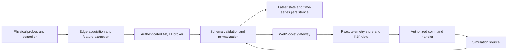

# Beverage cooler digital twin: research and engineering decisions

Research checked **7 September 2026** against manufacturer documents, official project documentation, standards, and the npm registry. This is a design and implementation reference. The application's readings are simulated unless explicitly received from a configured hardware source. Its model is an Imbera/Coca-Cola GDM-style interpretation, not an OEM CAD model or a calibrated refrigeration model.

## 1. Physical reference and what is actually known

The manufacturer's current G319 product page identifies R290 refrigerant, an ETC1H electronic controller, electronic fan motors, and LED lighting. The controller coordinates temperature, defrost, compressor, and other functions. This establishes the appropriate equipment class, but does not establish accessible controller registers, a public sensor API, or an inverter compressor. [Imbera G319 product page](https://us.imberacooling.com/products/g319/)

The linked **G319 HC BW specification sheet**, dated 2021 in the document, is the dimensional reference:

| Property | Published value | Consequence for the twin |
|---|---|---|
| Exterior H × W × D | 201 × 75 × 71 cm | Tall, comparatively narrow cabinet proportions |
| Usable volume | 543.7 L / 19.2 ft³ | Equipment metadata, not a stock count |
| Shelves / doors | 5 / 1 | Five separately selectable shelf tiers |
| Door construction | Plastic frame | Separate trim, glazing, handle, and hinge |
| Cabinet / liner | Pre-painted steel | Coated surfaces with restrained metallic response |
| Refrigerant | R290, 65 g | Reference metadata only |
| Compressor power | 1/3 HP | Does not determine actual electrical watts |
| Supply / published current | 115 V, 60 Hz / 7.0 A | Electrical rating, not measured running current |
| Default controller cut-out / cut-in | 0°C / 7°C | Do not confuse with uniform product temperature |
| Published energy | 1.820 kWh / 24 h | Test-condition result, not a live energy estimate |

These values describe that sheet's variant; a physical deployment must resolve its exact model, serial number, nameplate, and configuration. [Imbera G319 HC BW specification sheet](https://us.imberacooling.com/media/2020/12/1020373_SPEC-SHEET_G319-1.pdf)

The requested red finish, branded fascia, shelf dividers, and glass treatment are art-direction requirements. The available source does not establish exact CAD, paint roughness, low-E spectral properties, bottle planograms, or sensor positions. Avoid presenting those choices as measured OEM properties.

## 2. Refrigeration mechanics and simulation scope

A vapor-compression system moves heat from the evaporator to the condenser: refrigerant evaporates at low pressure, the compressor raises vapor pressure, the condenser rejects heat, and a metering restriction lowers pressure before the evaporator. A small cabinet may use a capillary restriction; do not invent a thermostatic expansion valve for this unit. Condenser pressure and evaporator pressure are different measurements. [Danfoss, refrigeration fundamentals](https://assets.danfoss.com/documents/latest/49699/AX000086437108en-000202.pdf)

The following are **engineering assumptions for an illustrative model**, not measured G319 behavior:

- Door opening increases exchange with room air and introduces moisture. Air probes respond faster than beverage cores; a short air spike cannot be interpreted as an equivalent product-temperature excursion.
- Top, middle, and bottom zones should have coupled, gradual responses. Their ordering depends on fan flow, loading, probe placement, and door position; the top zone need not always be warmest on a real unit.
- Compressor operation should respond to temperature demand with hysteresis and a minimum switching interval. Independent random numbers produce a plausible-looking dashboard without a coherent physical state.
- A loaded cabinet has more thermal inertia than an empty cabinet. A more advanced model should explicitly track product temperature and stock mass.
- Humidity depends on both moisture content and temperature. A first-order RH demo can demonstrate a door event, but a calibrated model should track absolute humidity or humidity ratio and convert using temperature, including condensate removal.

A useful later calibration model is:

```text
C_air,i × dT_air,i/dt = UA_i × (T_ambient − T_air,i)
                      + K_door,i × doorOpen × (T_ambient − T_air,i)
                      + Σ K_ij × (T_air,j − T_air,i)
                      + H_product,i × (T_product,i − T_air,i)
                      − coolingCapacity_i × compressorOn

C_product,i × dT_product,i/dt = H_product,i × (T_air,i − T_product,i)
```

Here `C` is thermal capacitance in J/K, `UA`, `K`, and `H` are conductances in W/K, and cooling capacity is W. These equations are an explicit proposed model. Coefficients need identification from empty/loaded pull-down tests and controlled door events; a 1 Hz stream alone does not make the simulation physically calibrated.

Pressure, current, vibration, and runtime should evolve consistently with compressor state. Pressure should equalize gradually after stopping; current should approach standby unless it explicitly measures only the compressor circuit. A one-second report usually misses the true startup-current peak. Runtime is accumulated duration, while duty cycle is on-time divided by a **declared observation window**. Power factor, voltage, and measured real power are needed for defensible energy calculations; `V × A` is apparent power, not necessarily watts.

## 3. Hardware telemetry map

This is a proposed retrofit instrumentation plan, not a claim that the stock cooler exposes these channels.

| Channel | Suggested source / location | Contract and interpretation |
|---|---|---|
| Top / middle / bottom temperature | Three calibrated air probes in representative airflow | °C; channel identity and calibration offset; avoid direct LED heat or contact with the liner |
| Product temperature | Optional buffered or instrumented product probe | Separate from air temperature; preserve thermal lag |
| RH | Temperature-compensated digital RH sensor in protected airflow | %RH plus co-located temperature, quality, condensation/heater state |
| Door | Magnetic reed or Hall sensor | Debounced physical state, transition timestamp, accumulated open duration |
| Compressor current | Isolated current measurement on the correct circuit | RMS A; distinguish whole-unit load from compressor-only load |
| Refrigerant pressure | Rated transducer installed at an identified service point | Name `suctionPressureBarG` or `dischargePressureBarG`; never ambiguous `pressure` |
| Compressor vibration | Firmly mounted accelerometer | Dominant spectral Hz, RMS acceleration, axis, sample rate, FFT window |
| Stock | Shelf load sensing, optical/ToF sensing, or vision adapter | Slot occupancy is inferred; include unknown state and confidence for hardware |
| Ambient temperature / RH | Probe outside condenser discharge and direct sun | Boundary conditions for diagnosis and simulation |
| Fan / defrost / faults | Documented controller interface, if available | Controller-specific mapping and firmware version |

Sensor selection needs range, accuracy over the actual operating conditions, enclosure design, and calibration. For example, the SHT4x family provides digital temperature/RH measurements with variant-specific accuracy and protection options. Its family headline accuracy must not be assigned indiscriminately to every variant. [Sensirion SHT4x datasheet](https://sensirion.com/media/documents/33FD6951/661CD142/HT_DS_Datasheet_SHT4x.pdf)

Thermal coupling to a PCB or enclosure can bias air measurements and slow response. Keep the sensing region thermally isolated from self-heating electronics, with appropriate airflow and condensation protection. [Sensirion temperature and humidity sensor design guide](https://sensirion.com/media/documents/FC5BED84/662A065D/Sensirion_Temperature_Sensors_Design_Guide_V1.pdf)

**The requested “45 Hz” badge is vibration frequency.** It is not evidence of motor speed, electrical supply frequency, or compressor drive frequency. Useful vibration diagnosis requires a sampled waveform, suitable bandwidth, anti-aliasing, and spectral processing. Publish a 1 Hz feature summary calculated from a much faster acquisition window; sampling raw acceleration once per second cannot resolve 45 Hz. [Analog Devices, MEMS vibration monitoring](https://www.analog.com/en/resources/analog-dialogue/articles/intro-to-mems-vibration-monitoring.html), [Analog Devices, aliasing in accelerometers](https://www.analog.com/en/resources/technical-articles/elusive-tones-aliasing-effects-in-digital-mems-accelerometers-in-condition-monitoring.html)

## 4. Blender asset and PBR decisions

### Asset structure

Use a reproducible Blender Python script as the source of truth. Build a shaped, beveled cabinet with an actual cavity; separate the door's hinge parent, frame, gasket, glass, and handle. Keep named components for interaction and stable telemetry anchors. Shelves and bottle meshes can share geometry. Merge static sub-parts only where doing so preserves interaction groups. Apply geometry modifiers before export where needed, clean normals, and inspect the result from the rear and at door extremes.

The door's origin belongs at its physical hinge line. Rotating the whole door around its center produces an obvious mechanical error. A single hinge group should carry frame, glass, handle, and any door branding together. Keep a consistent metric scale and verify coordinate conversion after Blender's export to glTF's Y-up convention.

### Materials and light

Paint is a dielectric coating even when its substrate is steel. Start with low metalness for red paint and controlled clearcoat; reserve metallic response for exposed chrome. Use roughness differences to separate trims, gasket, grille, and liner. For the glass, prefer physical transmission and an environment map over opacity alone. Three.js documents that transmission preserves reflection and should generally be paired with opacity 1; advanced physical effects cost additional shading work. A low-E appearance here is a visual approximation, not a spectral coating simulation. [Three.js MeshPhysicalMaterial](https://threejs.org/docs/pages/MeshPhysicalMaterial.html)

Three.js uses linear working-space lighting with sRGB display output. Base-color and emissive textures require color-space annotations; roughness, normal, metallic, and AO textures contain data rather than color. Modern Three.js enables color management by default. Do not “fix” incorrectly tagged textures by overexposing scene lights. [Three.js color management](https://threejs.org/manual/en/color-management.html)

Emissive strips provide the visible LED appearance; interior point/spot lights illuminate the contents. The key directional light creates the primary shadow, with fill and rim lighting to define cabinet edges. Shadowing every LED is unnecessarily expensive. Keep HDR reflections subtle enough that merchandise remains legible through closed glass.

### AO and compression

An AO bake needs a real image target, non-overlapping usable UVs, margins, and an actual bake operation. In Blender's documented export arrangement, a `glTF Material Output` node group with an `Occlusion` input exposes the baked image to the exporter. The active exporter version should be checked because Blender's node APIs evolve. [Blender glTF exporter manual](https://docs.blender.org/manual/en/3.6/addons/import_export/scene_gltf2.html)

glTF samples AO from the texture's red channel and applies it to indirect illumination, not direct light. Verify the exported material has `occlusionTexture`; a texture named “AO” alone proves nothing. Keep ambient crevice shading separate from strong direction-specific baked shadows, which would become incorrect when the door moves. [Khronos glTF 2.0 material specification](https://registry.khronos.org/glTF/specs/2.0/glTF-2.0.html#materials)

Draco compresses geometry, not textures. Confirm `KHR_draco_mesh_compression` appears in the exported primitives and extension declarations. When no uncompressed geometry fallback is present, the extension is required and the browser must have a decoder. This does not reduce runtime draw calls by itself. [Khronos Draco extension](https://github.com/KhronosGroup/glTF/tree/main/extensions/2.0/Khronos/KHR_draco_mesh_compression)

Inspect, deduplicate, prune, and compress deliberately; avoid a blind flatten operation that destroys the hinge hierarchy. glTF Transform offers these operations separately, allowing interaction-critical nodes to survive optimization. Texture compression is an additional decision, not a benefit obtained automatically by Draco. [glTF Transform CLI](https://gltf-transform.dev/cli)

## 5. R3F rendering and interaction strategy

- Load the GLB once with `useGLTF`, cache shared geometry/materials, and preload it. Use a locally served Draco decoder for predictable deployments. Drei documents both its default CDN behavior and explicit decoder paths. [Drei useGLTF](https://github.com/pmndrs/drei/blob/master/docs/loaders/gltf-use-gltf.mdx)
- Supply a bundled HDR file through `Environment files`. Drei explicitly describes presets as convenience assets that depend on a CDN and may fail in production. A static environment avoids repeated cubemap capture work. [Drei Environment](https://github.com/pmndrs/drei/blob/master/docs/staging/environment.mdx)
- Preserve the requested `antialias: true` and `preserveDrawingBuffer: true`. Treat the latter as a deliberate screenshot/export requirement, and benchmark it on target GPUs.
- Use one telemetry subscription/store. React updates at the telemetry reporting cadence are reasonable for text and charts; animation should mutate a hinge ref using elapsed-time-aware interpolation or GSAP. Avoid setting React state every render frame or allocating vectors in that loop. [R3F performance pitfalls](https://github.com/pmndrs/react-three-fiber/blob/master/docs/advanced/pitfalls.mdx)
- Share or instance beverage geometry; keep a small number of materials. Bound DPR, shadow-map resolution, HTML labels, and postprocessing. R3F recommends reuse, instancing, demand rendering, and adaptive quality. With demand rendering, any imperative tween needs invalidation until it settles. [R3F scaling performance](https://r3f.docs.pmnd.rs/advanced/scaling-performance)
- Keep hover selection local and stop pointer-event propagation where the glass would otherwise select shelves behind it. A distinct hit target may be easier to use than narrow grille bars.
- Anchor a small number of `<Html>` readouts in model coordinates. Large label counts introduce DOM work and obscure the model. Match badge wording to the actual physical channel and indicate stale readings.
- Mirror mesh interactions with ordinary keyboard-accessible buttons. Provide loading, asset-error, disconnected, and unsupported-WebGL states. A user must still be able to inspect telemetry when WebGL is unavailable.

## 6. Backend architecture and transport contract

The following is the intended scalable design; it does not imply that every production service is included in the local demonstration.



The simulation source and hardware adapter should emit the same versioned envelope, containing asset identity, source, boot/session identity, sequence number, sample timestamp, and quality. A server receive timestamp supports latency analysis but cannot replace device sample time. Missing hardware channels should remain unavailable, not silently become synthetic values. Stock occupancy should use stable shelf/slot identities across UI, asset, and ingestion.

For the browser gateway, send an initial snapshot, then 1 Hz updates. Parse and validate message types; reject malformed payloads and impossible structures. Bound message size, connection count, history, and slow-client buffers. Use ping/pong to detect broken sockets. The `ws` project documents heartbeat patterns, upgrade authentication, and compression tradeoffs. [ws official documentation](https://github.com/websockets/ws)

Reconnect with jitter and a maximum delay. Mark data stale after a configurable number of missed reports even when the socket remains open. Clear intervals and reconnect timers on unmount or shutdown. UI commands need a request ID, acknowledgment, rejection reason, and authoritative returned state. Prefer an idempotent `doorOpen: true` intent over a bare `toggle` message that could be duplicated. An animation can optimistically respond, but must reconcile after server rejection or another client's change.

For hardware ingestion, use MQTT over TLS with separate topic permissions per asset. MQTT 5 QoS 1 permits duplicates, retained messages are snapshots rather than history, and session/message expiry can bound stale delivery. Last Will can advertise unexpected disconnects. Deduplicate application events using asset/session/sequence; protocol packet identifiers are not permanent event IDs. [OASIS MQTT 5.0 standard](https://docs.oasis-open.org/mqtt/mqtt/v5.0/mqtt-v5.0.html)

The Node MQTT adapter should specify protocol version and deliberate reconnect behavior. MQTT.js defaults to a one-second reconnect period and exposes controls for retry behavior; do not assume a denied authentication attempt has the same reconnect semantics as a dropped connection. [MQTT.js documentation](https://github.com/mqttjs/MQTT.js)

At fleet scale, partition normalization by asset, persist history outside the WebSocket process, and distribute normalized events to horizontally scaled gateways. Each gateway owns its active browser sockets. Avoid starting an independent simulator for the same asset in every replica. A server-local array or timer is a useful development implementation but not durable fleet state.

Authentication, tenant/asset authorization, TLS termination, origin checks, rate limits, audit records, and secret handling must be configured before external deployment. Express's security guidance covers TLS, untrusted input, secure headers, cookies, and dependency maintenance. Browser origin checks complement authentication; they do not establish a user's right to control an asset. [Express production security](https://expressjs.com/en/advanced/best-practice-security/)

## 7. Versions checked during implementation

These were the npm `latest` releases returned on the research date. The application lockfile is the authoritative record of what was actually installed. A future install should use the lockfile rather than silently migrating to future majors.

| Package | Registry latest | Compatibility finding |
|---|---|---|
| React / React DOM | 19.2.8 | Matching versions; [React registry](https://registry.npmjs.org/react/latest), [React DOM registry](https://registry.npmjs.org/react-dom/latest) |
| Three.js | 0.185.1 | [Three.js registry](https://registry.npmjs.org/three/latest) |
| `@react-three/fiber` | 9.7.0 | React `>=19 <19.3`; [R3F registry](https://registry.npmjs.org/@react-three%2ffiber/latest) |
| `@react-three/drei` | 10.7.8 | React 19 and Fiber 9 peers; [Drei registry](https://registry.npmjs.org/@react-three%2fdrei/latest) |
| Vite | 8.2.2 | Node `^20.19.0` or `>=22.12.0`; [Vite registry](https://registry.npmjs.org/vite/latest) |
| Express | 5.2.1 | Node 18+; [Express registry](https://registry.npmjs.org/express/latest) |
| `ws` | 8.21.3 | [ws registry](https://registry.npmjs.org/ws/latest) |
| MQTT.js | 5.15.2 | Node 16+; [MQTT registry](https://registry.npmjs.org/mqtt/latest) |
| GSAP | 3.15.0 | [GSAP registry](https://registry.npmjs.org/gsap/latest) |

## 8. Acceptance criteria and remaining validation

The implementation should be checked at three separate levels:

1. **Asset:** Blender source reproduces the model; GLB contains the intended named nodes, AO binding, and Draco extension; the door pivots correctly; the glass and labels remain legible; no hidden dependency is required for the HDR or decoder.
2. **Behavior:** Two clients observe the same authoritative state; opening the door changes simulated air/RH trends; closing restores recovery; stock edits persist during the running session; invalid commands are rejected; reconnect/staleness states are visible; repeated mounting does not multiply socket subscriptions.
3. **Deployment:** Target-device frame time, draw calls, memory, and load performance are measured; protocol contracts are validated against actual devices; calibration and channel units are documented; authentication, persistence, tenant isolation, observability, and rollback are operational.

Keep measured test results separate from these proposed acceptance criteria. A working local browser demonstration establishes functional behavior, not fleet scalability or real-sensor accuracy. Pressure and vibration trends here are illustrative rather than maintenance diagnoses. Connecting hardware requires the actual channel mapping and calibration work; changing a transport URL alone cannot supply those facts.
