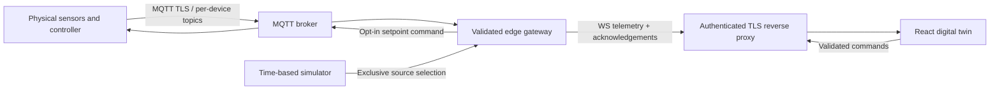

# Cooler telemetry gateway

Node.js, Express 5, `ws`, MQTT.js and Zod implement a small IoT edge gateway. The simulator and hardware adapter emit the same versioned contract; the browser never has to synthesize sensor values to stay connected. The frontend labels its data source explicitly.

## Run

From `cooler-twin` with Node.js 22.12+ (Node.js 24 LTS recommended):

```sh
npm install
npm run dev
```

`npm run dev:server` runs only the telemetry process with file watching. `npm test` runs the thermal-model, validation and real HTTP/WebSocket integration tests. `npm run build` checks TypeScript and builds the browser application. After building, `npm start` serves both `dist/` and telemetry on port 3002; open `http://127.0.0.1:3002`. This same-origin production path needs no separate frontend proxy. `npm run preview` is Vite's local asset preview, not the production service.

Copy `server/.env.example` to `.env` in the `cooler-twin` directory to override configuration. The service listens on `127.0.0.1:3002`; its configured `HOST` must be a loopback address. The frontend development server proxies `/api` and `/ws` to this address.

| Setting | Default | Meaning |
| --- | --- | --- |
| `HOST`, `PORT` | `127.0.0.1`, `3002` | Local gateway listener |
| `DEVICE_ID` | `GDM-001` | Device identity; letters, digits, `_`, `-` |
| `TELEMETRY_SOURCE` | `simulator` | `simulator` or `hardware`; mutually exclusive |
| `SIMULATION_TIME_SCALE` | `1` | Physical simulation seconds per real second; 0.1–30 |
| `ALLOWED_ORIGINS` | localhost/127.0.0.1 on 5180, 4173 and 3002 | Comma-separated exact browser origins |
| `MQTT_URL` | unset | Required for hardware mode; prefer `mqtts://` |
| `MQTT_USERNAME`, `MQTT_PASSWORD` | unset | Broker credentials; environment only |
| `HARDWARE_COMMANDS_ENABLED` | `false` | Opt-in forwarding of setpoint requests |

## Wire contract

`shared/telemetry.ts` defines the runtime validators and TypeScript types. All numbers must be finite and range checked. Unknown fields are rejected so schema drift is visible.

- `GET /api/health` reports source, age, connected clients, broker state, rejected ingress packet count and time scale. HTTP 503 means no data or data older than five seconds.
- `GET /api/telemetry` returns the latest raw telemetry object, or HTTP 503 until the first physical reading. A stale latest reading has an HTTP `Warning` header; the health endpoint is the freshness authority.
- WebSocket `/ws` immediately sends the latest available snapshot, then updates at approximately 1 Hz for simulation, or at the physical device's publication cadence in hardware mode.

```json
{
  "type": "telemetry",
  "data": {
    "schemaVersion": 1,
    "deviceId": "GDM-001",
    "sequence": 1,
    "timestamp": "2026-09-07T12:00:00.000Z",
    "source": "simulator",
    "doorOpen": false,
    "temperature": { "top": 3.5, "middle": 3.2, "bottom": 2.9, "setpoint": 3, "ambient": 24 },
    "humidity": 48,
    "compressor": { "running": true, "currentAmps": 2.14, "pressureBar": 8.2, "dutyCycle": 28.5, "runtimeSeconds": 8100, "vibrationHz": 45 },
    "stock": [
      [true, true, true, true, true, true, false, true],
      [true, true, false, true, true, true, true, true],
      [true, true, true, true, true, false, true, true],
      [true, true, true, true, true, true, true, false],
      [false, false, true, true, true, true, true, true]
    ],
    "powerWatts": 257,
    "energyKwh": 0,
    "alarms": []
  }
}
```

`stock[row][col]` maps bottom-to-top shelves (row 0 is the lowest), left-to-right visible front-facing slots, matching Blender's `Stock_<row>_<col>` groups. The 40 tracked presentation slots are deliberately not the manufacturer's total bottle/can capacity. `true` means occupied. Temperatures are air temperatures in Celsius, humidity is relative humidity percent, current is compressor amperes, `pressureBar` is **discharge gauge pressure in bar**, and `vibrationHz` is an accelerometer's dominant vibration frequency rather than compressor drive frequency. Runtime is lifetime compressor-on seconds; energy is session kWh. Duty is a percentage of observed time, seeded with a ten-minute demonstration history. In a hardware deployment the gateway contract expects the edge device to supply those counters and its documented duty observation window.

Commands are JSON text frames. Each request needs a unique `id` (1–80 characters):

```json
{"type":"command","id":"door-1","command":"set-door","value":true}
{"type":"command","id":"setpoint-1","command":"set-setpoint","value":3.5}
{"type":"command","id":"stock-1","command":"set-stock","value":{"row":0,"col":2,"filled":false}}
{"type":"command","id":"restock-1","command":"restock"}
{"type":"command","id":"reset-1","command":"reset"}
```

The response is `{"type":"ack","id":"door-1","ok":true}` or `{"type":"ack","id":"door-1","ok":false,"error":"..."}`. Setpoint range is 2–6°C; row is 0–4 and column is 0–7. The last 100 acknowledgements are cached per browser connection, preventing duplicate request IDs from repeating mutations during that connection. Pending duplicate requests are ignored until the first acknowledgement. Browser reconnection creates a new idempotency scope; commands are not automatically replayed. Telemetry carries authoritative state after a simulator command.

## Simulator mechanics and assumptions

The air model integrates actual elapsed monotonic time in steps of at most one second. Each zone exchanges heat with ambient air, mixes with middle-zone return air, and loses heat when the compressor runs. Opening the door reduces the exchange time constant from approximately 45–57 minutes to 140–240 seconds, with warm infiltration strongest at the top; cooling effectiveness also drops to 35%. Closing the door gradually restores air temperature rather than snapping it to the setpoint.

The demonstration controller uses a ±0.5°C hysteresis band and a minimum 60-second dwell between compressor transitions. The manufacturer's published G319 controller cut-in/cut-out example is different; this demo is not a reproduction of proprietary ETC1H firmware. Relative humidity exponentially approaches a wetter open-door state and a drier cooling state. Small deterministic sinusoidal readout variation avoids visually static ideal sensors without random thermal jumps. Current, discharge pressure and dominant vibration values are illustrative load-dependent diagnostics, not a refrigerant thermodynamic solver or factory acceptance limits.

Power is 35 W for the fan/LED baseline plus 222–267 W when cooling. kWh integrate that power over simulated elapsed time. Actual consumption depends on the specific cooler, ambient conditions, door traffic and load. The initial 8,100 runtime seconds and ten-minute duty history are demonstration seeds; energy begins at zero. `reset` restores the demonstration state and counters, while retaining increasing stream sequence numbers. A delayed process or suspended laptop catches up at most 60 simulated seconds per tick.

Door-open warnings begin after 30 simulated seconds. A high-temperature demonstration alarm requires middle-zone air above 8°C for 60 seconds. Stock below 30% creates a low-stock warning. These thresholds are UI scenarios, not food-safety or equipment protection settings. Product-core temperature, defrost control, refrigerant mass flow, dew point, evaporator icing, sensor faults and predictive failure classification are not modeled.

The physical reference is an Imbera G319-style single-door merchandiser: the official [G319 product page](https://us.imberacooling.com/products/g319/) describes R290 refrigerant and electronic control, while the [manufacturer's specification sheet](https://us.imberacooling.com/wp-content/uploads/2020/12/1020373_SPEC-SHEET_G319-1.pdf) documents five shelves and an example configuration. Its 7.0 A electrical rating is not the simulated compressor's measured current. [Copeland's sensor overview](https://www.copeland.com/en-gb/products/refrigeration/commercial-electronics/sensors) distinguishes temperature, humidity and pressure sensing; its [CoreSense diagnostics](https://www.copeland.com/en-us/products/refrigeration/commercial-refrigeration/electronics/coresense-technology) illustrates protection and monitoring categories, not features claimed for this particular Imbera unit.

## Physical hardware connection

1. Set `TELEMETRY_SOURCE=hardware`, `DEVICE_ID` and `MQTT_URL`; provide broker credentials locally.
2. Configure an edge bridge (industrial controller, ESP32, Raspberry Pi or existing BMS adapter) to publish **the raw `data` object above**, with `source:"hardware"`, as QoS 1 on `coolers/GDM-001/telemetry`. Use real ISO UTC timestamps, synchronized clocks, finite readings and the exact sensor units in this contract. A new reading must have a newer timestamp than the last accepted reading.
3. Broker ACLs should give the device publish access to its own telemetry/ack topics and subscribe access to its own command topic. The gateway uses the inverse permissions. Use TLS and unique device credentials.
4. Mount and calibrate top/middle/bottom air probes, a humidity probe, a door reed switch and any stock sensors. Use properly isolated electrical metering and correctly rated pressure/vibration transducers. A qualified refrigeration technician should handle the sealed refrigerant system. An R290 system cannot gain a credible pressure reading from an ambient temperature sensor alone.

The adapter rejects malformed/oversized packets, wrong device IDs, simulator-labeled packets, stale timestamps older than two minutes, duplicates and timestamps over ten seconds in the future. It never creates a simulator in hardware mode; a disconnected physical device therefore produces a stale/offline state. Broker reconnection uses a two-second retry interval.

Hardware control is disabled by default. After explicit deployment configuration enables `HARDWARE_COMMANDS_ENABLED=true`, only `set-setpoint` is forwarded, to `coolers/GDM-001/command` with QoS 1 and `retain:false`. The gateway assigns a fresh UUID to avoid collisions between browsers. The device must enforce its own operational limits and publish the resulting `{"type":"ack","id":"<gateway UUID>","ok":true}` or an error acknowledgement to `coolers/GDM-001/ack`. Broker publish success is not treated as actuator success. The gateway waits up to eight seconds for the device acknowledgement and rewrites the ID back to the browser request ID. Only a subsequent valid telemetry packet changes displayed hardware state. Door, stock, restock and reset commands remain simulation-only.

## Deployment boundary and scaling



This deliverable is a runnable single-device edge service, with a broker boundary suitable for fleet expansion. It limits each process to 100 WebSocket clients, payloads to 4 KiB, commands to 40 per ten seconds per socket and queued outgoing bytes to 256 KiB. Ping/pong heartbeats remove dead sockets and shutdown clears timers, pending commands and broker connections. No live credentials are included. The loopback binding is deliberate: public deployment needs an authenticated TLS reverse proxy, authorization per device, broker TLS/ACLs and an explicit origin list. The service itself does not provide user accounts or durable history.

For a fleet, keep each physical device's source authoritative, partition subscriptions by device ID, and persist telemetry in a time-series database from the broker. Stateless WebSocket fan-out replicas can consume that event stream behind a load balancer. Store command IDs/results durably when deduplication must survive restarts or cross replicas, and add a broker-level command expiry policy. Do not run competing simulator writers on hardware telemetry topics. Public cloud hosting and physical commissioning are separate deployment work.
