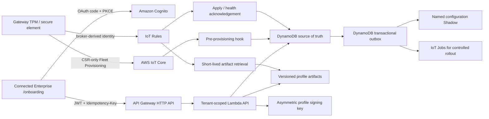

# Connected Enterprise onboarding on AWS

This repository implements gateway onboarding as an isolated `ConnectedEnterpriseOnboarding-dev` control plane. It does not reuse the legacy unauthenticated Device Manager APIs or their wildcard IoT policies.

## Architecture



DynamoDB and S3 are authoritative. The named Shadow contains only a small convergence descriptor. A deployment succeeds only after the authenticated gateway reports the matching generation, profile version, checksum, and healthy validation result.

## Security invariants

- The browser never receives AWS credentials, claim private keys, activation-proof digests, ownership tokens, device private keys, or profile secret values.
- Tenant and role come only from signed Cognito claims backed by an active DynamoDB membership. Tenant IDs in request payloads are ignored.
- Every mutation requires an `Idempotency-Key`; gateway deployments use a monotonic generation.
- The gateway creates its operational private key in hardware and submits only a CSR.
- The Fleet Provisioning hook accepts only an unexpired server-side enrollment reservation, the expected template, a batch-authorized claim certificate, and a device-unique hardware proof. The proof is consumed atomically.
- The provisioning template attaches one named least-privilege policy with `EXCLUSIVE_THING`. MQTT client ID must equal the attached Thing name.
- MQTT identity is taken from IoT Rule `principal()`, `clientid()`, and `topic()` fields, not from device-supplied identity fields.
- Reusable profiles contain only validated values and secret references. Inline passwords, tokens, PSKs, or private keys are rejected.
- Profile bodies and signed manifests are immutable S3 objects. Per-device assignment descriptors bind tenant, Thing, gateway, profile hash, generation, issue time, and expiry.
- Decommissioning disables the certificate before clearing the MQTT session; audit records are retained.

The stack deliberately does **not** create or export a provisioning certificate or private key. Prefer a unique manufacturer identity or trusted-installer flow. If a shared claim is unavoidable, create one per manufacturing batch, attach only the emitted bootstrap policy, protect the private key in the factory process, monitor usage, and deactivate it when the batch closes.

## Local operator flow

The Express implementation is a local simulator only. It persists state in `server/.data/onboarding.json` and is disabled when `NODE_ENV=production`.

```powershell
Copy-Item .env.example .env
npm install
npm run dev:full
```

Open `http://localhost:5174/onboarding`. The two local-only proof pairs are defined in the server seed code for development and must never be copied into AWS manufacturing inventory.

## Synthesize and deploy the dev control plane

Prerequisites: an authenticated AWS CLI session for the target account, Node.js 22-compatible tooling, and region `us-east-1`.

```powershell
Set-Location infrastructure
npm ci
npm run build
npm test
npm run synth
npx cdk bootstrap aws://<account-id>/us-east-1
npx cdk deploy ConnectedEnterpriseOnboarding-dev --require-approval never
```

The app is intentionally pinned to `dev` and enables CloudFormation termination protection plus retention/deletion protection for DynamoDB, S3, KMS, Cognito, and Secrets Manager data.

For a hosted UI, supply reviewed HTTPS origins and exact callback/logout URLs as CDK context. HTTP is accepted only for `localhost`/`127.0.0.1` development.

```powershell
npx cdk deploy ConnectedEnterpriseOnboarding-dev --require-approval never `
  -c 'allowedOrigins=["https://console.example.com"]' `
  -c 'oauthCallbackUrls=["https://console.example.com/onboarding"]' `
  -c 'oauthLogoutUrls=["https://console.example.com/onboarding"]'
```

## Connect the UI to the deployed stack

Read the CloudFormation outputs and set these build-time variables:

```dotenv
VITE_ONBOARDING_API_URL=<ApiUrl>
VITE_ONBOARDING_COGNITO_DOMAIN=<CognitoHostedUiBaseUrl>
VITE_ONBOARDING_COGNITO_CLIENT_ID=<CognitoSpaClientId>
VITE_ONBOARDING_REDIRECT_URI=https://connectedenterprise.app/onboarding
VITE_ONBOARDING_LOGOUT_URI=https://connectedenterprise.app/onboarding
VITE_ONBOARDING_DISABLE_SSE=true
```

The remote AWS API uses authenticated polling. The local simulator can use SSE. The EC2 process is reached through the canonical HTTPS ALB origin `https://connectedenterprise.app`; do not use the instance's direct HTTP address for Cognito onboarding.

The stack creates an AWS-provided Managed Login v2 branding style for the SPA client. Cognito clients created programmatically do not receive one automatically, and their login page is unavailable without it.

## Authoritative bootstrap data

Before a user can sign in, an administrator must create the Cognito user and an active membership record keyed by that user's Cognito `sub`:

```text
PK = USER#<cognito-sub>
SK = TENANT#<tenant-id>
entityType = MEMBERSHIP
tenantId = <tenant-id>
role = platform_admin | tenant_admin | operator | auditor
status = ACTIVE
isDefault = true
```

The tenant partition must contain authorized `TENANT`, `SITE`, and `GATEWAY_MODEL` records. A manufacturing import must create a globally keyed record:

```text
PK = SERIAL#<normalized-serial>
SK = MANUFACTURING
state = CLAIMABLE
hardwareId = <device-unique-id>
hardwareProofDigest = HMAC-SHA256(server-pepper, normalized-serial + NUL + device-proof)
credentialScheme = HMAC_SHA256_PEPPER_V1
credentialKeyVersion = 1
claimCertificateId = <authorized-batch-claim-certificate-id>
modelId = <authorized-model-id>
tenantId = <tenant-id>
allowedSiteIds = [<site-id>, ...]
```

Use a controlled importer that reads the hardware proof without placing it in command history or logs. Never store the raw proof in DynamoDB. A serial number is an identifier, not authentication evidence.

## Gateway contract

1. Validate WAN, DNS, NTP, TLS hostname, and the ATS trust chain.
2. Generate a non-exportable operational key and CSR in the TPM/secure element.
3. Connect with a random `bootstrap-*` client ID and the authorized batch claim.
4. Use `CreateCertificateFromCsr`, then `RegisterThing` with serial, hardware ID, and the device-unique proof. Subscribe to accepted/rejected topics before publishing.
5. Disconnect the claim session and reconnect with the assigned Thing name as MQTT client ID.
6. After the permanent-certificate reconnect, request the initial immutable artifacts on `ce/v1/gateways/{thingName}/config/request`. For later assignments, converge on the newer generation announced through named Shadow `configuration` or an IoT Job, then request that generation.
7. Receive the short-lived response on `ce/v1/gateways/{thingName}/config/response`, verify the KMS signature, tenant/Thing binding, generation, expiry, and SHA-256 hash.
8. Stage and translate the vendor-neutral profile through the gateway data model, apply transactionally, health-check, and roll back on failure.
9. Report progress on `ce/v1/gateways/{thingName}/status`. `APPLIED_HEALTHY` must include `generation`, `profileVersionId`, and `profileChecksum`, where the checksum is the lowercase SHA-256 digest from the authoritative descriptor.
10. If the candidate fails and the gateway restores its last-known-good configuration, `ROLLED_BACK` must attest that restored configuration with the same `generation` plus the **previously applied** `profileVersionId` and `profileChecksum`. A missing, mismatched, or unverifiable rollback target—including an initial onboarding attempt with no healthy baseline—causes quarantine instead of returning the gateway to an assignable state.

The device must reject stale generations, expired descriptors, incompatible models/firmware, invalid signatures, hash mismatches, and rollback attempts without explicit signed authorization.

Profile reassignment uses `POST /api/onboarding/gateways/{gatewayId}/assignments` with `profileVersionId` and `deliveryMode` (`SHADOW` for immediate convergence or `JOB` for a controlled rollout). The control plane always creates a new operation and monotonic generation. Inventory reports the last attested applied profile separately from any in-flight desired profile.

## Operational gates before production

The deployed stack is a dev environment. Before promoting the design, complete these account- and device-level controls:

- host the UI behind HTTPS and add WAF/rate controls at the public edge;
- use separate production, security, and log-archive accounts;
- enable organization CloudTrail, IoT V2 logging, Device Defender Audit/Detect, alert routing, and immutable audit export;
- operate the included dry-run-first manufacturing importer through an approved factory workflow, and complete the batch-claim lifecycle, quota alarms, certificate rotation, ownership transfer, quarantine, recovery, and disaster-recovery runbooks;
- implement and test the gateway-side TPM/CSR, signature verification, TR-181 adapter, transactional apply, rollback, and negative policy tests;
- implement device-bound encrypted secret overlays before using non-empty VPN/Wi-Fi secret references;
- load-test paginated API access, DynamoDB entity indexes, IoT Rule/Lambda concurrency, Jobs rollout limits, and the documented DLQ replay procedure.

Do not migrate devices from the legacy stack until cross-device, cross-tenant, replay, stale-generation, rollback, decommission, and certificate-recovery tests pass.
