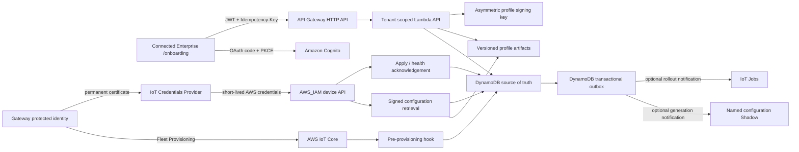

# Connected Enterprise onboarding on AWS

This repository implements gateway onboarding as an isolated `ConnectedEnterpriseOnboarding-dev` control plane. It does not reuse the legacy unauthenticated Device Manager APIs or their wildcard IoT policies.

## Architecture



DynamoDB and S3 are authoritative. The named Shadow contains only a small convergence descriptor. A deployment succeeds only after the authenticated gateway reports the matching generation, profile version, checksum, and healthy validation result.

## Security invariants

- The browser never receives AWS credentials, bootstrap private keys, ownership tokens, device private keys, or profile secret values.
- Tenant and role come only from signed Cognito claims backed by an active DynamoDB membership. Tenant IDs in request payloads are ignored.
- Every mutation requires an `Idempotency-Key`; gateway deployments use a monotonic generation.
- Every operational certificate uses a device-specific key. The production gateway generates that key locally and submits a CSR; the current gateway integration test may exercise AWS certificate/key creation while its persistence and recovery behavior is validated.
- The Fleet Provisioning hook accepts only an unexpired server-side enrollment reservation, the expected template, and the exact active unique bootstrap certificate already bound to that serial.
- The provisioning template attaches one named least-privilege policy with `EXCLUSIVE_THING`. MQTT client ID must equal the attached Thing name.
- For remaining MQTT ingestion paths, identity is taken from IoT Rule `principal()`, `clientid()`, and `topic()` fields, not from device-supplied identity fields.
- Device HTTP requests use short-lived credentials issued through the one configured IoT role alias. Its IAM policy permits only the requesting certificate's Thing-bound GET configuration and POST status paths; each Lambda independently revalidates the assumed role, Thing, certificate, and DynamoDB identity binding.
- Reusable profiles contain only validated values and secret references. Inline passwords, tokens, PSKs, or private keys are rejected.
- Profile bodies and signed manifests are immutable S3 objects. Per-device assignment descriptors bind tenant, Thing, gateway, profile hash, generation, issue time, and expiry. S3 is private backend storage: the device API verifies and inlines the profile JSON and does not expose S3 keys or presigned URLs.
- Decommissioning disables the certificate before clearing the MQTT session; audit records are retained.

The stack deliberately does **not** create or export bootstrap certificates or private keys. A controlled factory process creates one AWS IoT bootstrap identity per gateway, attaches only the emitted bootstrap policy, flashes that exact credential into the gateway's protected storage, and records its public certificate ID against the serial. Shared or reusable bootstrap credentials are not supported.

## Local operator flow

The Express implementation is a local simulator only. It persists state in `server/.data/onboarding.json` and is disabled when `NODE_ENV=production`.

```powershell
Copy-Item .env.example .env
npm install
npm run dev:full
```

Open `http://localhost:5174/onboarding`. Local seed inventory is development-only and must never be copied into AWS manufacturing inventory.

## Synthesize and deploy the dev control plane

Prerequisites: an authenticated AWS CLI session for the target account, Node.js 22-compatible tooling, and region `us-east-1`.

```powershell
Set-Location infrastructure
npm ci
npm run build
npm test
npm run synth
npx cdk bootstrap aws://<account-id>/us-east-1
npx cdk deploy ConnectedEnterpriseOnboarding-dev --require-approval never
```

The app is intentionally pinned to `dev` and enables CloudFormation termination protection plus retention/deletion protection for DynamoDB, S3, KMS, Cognito, and Secrets Manager data.

For a hosted UI, supply reviewed HTTPS origins and exact callback/logout URLs as CDK context. HTTP is accepted only for `localhost`/`127.0.0.1` development.

```powershell
npx cdk deploy ConnectedEnterpriseOnboarding-dev --require-approval never `
  -c 'allowedOrigins=["https://console.example.com"]' `
  -c 'oauthCallbackUrls=["https://console.example.com/onboarding"]' `
  -c 'oauthLogoutUrls=["https://console.example.com/onboarding"]'
```

## Connect the UI to the deployed stack

Read the CloudFormation outputs and set these build-time variables:

```dotenv
VITE_ONBOARDING_API_URL=<ApiUrl>
VITE_ONBOARDING_COGNITO_DOMAIN=<CognitoHostedUiBaseUrl>
VITE_ONBOARDING_COGNITO_CLIENT_ID=<CognitoSpaClientId>
VITE_ONBOARDING_REDIRECT_URI=https://connectedenterprise.app/onboarding
VITE_ONBOARDING_LOGOUT_URI=https://connectedenterprise.app/onboarding
VITE_ONBOARDING_DISABLE_SSE=true
```

The remote AWS API uses authenticated polling. The local simulator can use SSE. The EC2 process is reached through the canonical HTTPS ALB origin `https://connectedenterprise.app`; do not use the instance's direct HTTP address for Cognito onboarding.

The stack creates an AWS-provided Managed Login v2 branding style for the SPA client. Cognito clients created programmatically do not receive one automatically, and their login page is unavailable without it.

## Authoritative bootstrap data

Before a user can sign in, an administrator must create the Cognito user and an active membership record keyed by that user's Cognito `sub`:

```text
PK = USER#<cognito-sub>
SK = TENANT#<tenant-id>
entityType = MEMBERSHIP
tenantId = <tenant-id>
role = platform_admin | tenant_admin | operator | auditor
status = ACTIVE
isDefault = true
```

The tenant partition must contain authorized `TENANT`, `SITE`, and `GATEWAY_MODEL` records. Before the UI onboarding begins, an authorized operator binds the serial to the exact unique certificate already flashed into that gateway:

```text
PK = SERIAL#<normalized-serial>
SK = MANUFACTURING
state = CLAIMABLE
claimMechanism = PRELOADED_UNIQUE_BOOTSTRAP
bootstrapCertificateId = <64-hex AWS IoT certificate ID>
bootstrapCertificateStatus = ACTIVE
modelId = <authorized-model-id>
tenantId = <tenant-id>
allowedSiteIds = [<site-id>, ...]
```

The binding tool validates that the public certificate matches AWS, is active, has only the expected bootstrap policy, is not attached to a Thing, and is not already bound to another serial. The authenticated UI then reserves this tenant-bound serial and creates the `ENROLLMENT_PENDING` operation. Only after that UI state exists is the gateway started. The serial remains an identifier; possession of the exact pre-bound private key supplies the bootstrap authentication.

## Bootstrap connectivity versus the managed profile

The gateway must already have enough local bootstrap networking to reach AWS before it can retrieve a managed profile. At minimum, manufacturing or the installer must provide a working WAN link and address method, a default route, DNS resolution, correct time for TLS, and the Amazon Trust Services root chain. This can be a simple WAN DHCP configuration; a site that cannot use DHCP must provide its static WAN address, prefix, gateway, and DNS through the protected bootstrap channel.

That bootstrap configuration is not the post-onboarding managed configuration. After Fleet Provisioning succeeds, the gateway uses its operational certificate to obtain short-lived credentials and retrieves the complete immutable, signed profile over the AWS_IAM HTTPS API. The profile can then replace the temporary bootstrap WAN/DNS settings transactionally. This ordering avoids the circular dependency of needing the AWS-delivered configuration in order to reach AWS.

AWS IoT Thing attributes and Fleet Provisioning parameters carry onboarding identity and routing metadata only (for example, Thing name, gateway ID, serial, and tenant binding). DHCP, WAN, DNS, NTP, LAN, forwarding, and NAT settings belong in the signed profile document stored by the control plane; they are not copied into Thing attributes. The gateway receives the whole signed configuration for the assigned generation, rather than selecting fields from Thing metadata.

## Profile schema v2 network settings

New UI profile requests explicitly send numeric `schemaVersion: 2`. Requests that omit `schemaVersion` retain the legacy v1 contract, and already persisted v1 profiles remain readable. Schema v2 keeps all v1 parameters and adds these flat scalar settings:

| Parameter | Default | Validation / meaning |
| --- | --- | --- |
| `lanMtu` | `1500` | Integer `576–9216` |
| `dhcpServerEnabled` | `true` | Enables the LAN DHCP server |
| `dhcpPoolStart` / `dhcpPoolEnd` | `10.10.10.100` / `10.10.10.199` | Valid ordered IPv4 range in the LAN subnet; must exclude the LAN gateway, network, and broadcast addresses when DHCP is enabled |
| `dhcpLeaseSeconds` | `86400` | Integer `60–2592000` |
| `wanMode` | `DHCP` | `DHCP` or `STATIC` |
| `wanStaticIpAddress` / `wanStaticGateway` | empty | Valid IPv4 values required only when `wanMode=STATIC` |
| `wanStaticPrefixLength` | `24` | Integer `1–30`; dormant under DHCP |
| `wanVlanId` | `0` | Integer `0–4094`; `0` means untagged |
| `dnsMode` | `WAN_DHCP` | `WAN_DHCP` or `STATIC`; `WAN_DHCP` is valid only with DHCP WAN |
| `dnsPrimaryServer` / `dnsSecondaryServer` | empty | Primary is required for static DNS; secondary is optional |
| `dnsSearchDomain` | empty | Optional DNS domain, at most 253 characters |
| `dnsCacheEnabled` | `true` | Enables the local DNS cache |
| `ntpPrimaryServer` / `ntpSecondaryServer` | `time.cloudflare.com` / `time.google.com` | Valid NTP host names |
| `ipv4ForwardingEnabled` | `true` | Enables IPv4 forwarding |
| `natMode` | `MASQUERADE` | `MASQUERADE` or `DISABLED` |
| `defaultRouteMetric` | `100` | Integer `0–65535` |

Dormant static WAN/DNS values may be omitted or empty. Likewise, DHCP pool values may be omitted while the LAN DHCP server is disabled. The v2 core LAN/WAN/DNS/NTP/forwarding/NAT catalog fields are required, and as soon as a mode activates its conditional values, the API validates the complete active combination before publishing an immutable version. Validation also rejects unsafe/reserved IPv4 addresses, overlapping LAN and static-WAN subnets, duplicate DNS/NTP endpoints, and masquerading without IPv4 forwarding.

## Gateway contract

1. Validate WAN, DNS, NTP, TLS hostname, and the ATS trust chain.
2. Load the unique pre-flashed bootstrap certificate/key from protected device storage and connect with a `claim-*` client ID.
3. Request one operational certificate. The production path should generate its operational key locally and use `CreateCertificateFromCsr`; the current gateway integration test may use `CreateKeysAndCertificate`.
4. Persist the new operational certificate/key before calling `RegisterThing`, then call `RegisterThing` with only `SerialNumber`. Subscribe to accepted/rejected topics before publishing.
5. Disconnect the bootstrap session and use only the assigned Thing name plus permanent operational certificate/key. If the gateway also connects to MQTT for optional Shadow or Job notifications, its MQTT client ID must equal that Thing name.
6. Call the IoT Credentials Provider with the configured role alias and Thing-name header. Use the returned short-lived AWS credentials to SigV4-sign `GET /device/v1/things/{thingName}/certificates/{certificateId}/configuration?generation={generation}`. Poll the next monotonic generation with backoff; named Shadow `configuration` or an IoT Job may optionally accelerate discovery of a later generation, but neither is required for the pull.
7. Consume the `GATEWAY_CONFIGURATION` JSON returned by the signed GET. Read the allowlisted `gateway`, `assignment`, and complete inline `configuration` objects; verify the compact `integrity` claim with the pinned KMS public key, require `gatewayMetadataSha256` to equal the SHA-256 of the canonical `gateway` object, check its Thing/gateway/generation/profile binding and expiry, canonicalize the configuration, and require its SHA-256 to equal `integrity.profileSha256` and `assignment.profileChecksum`. No second S3 download is required by the gateway.
8. Stage and translate the vendor-neutral profile through the gateway data model, apply transactionally, health-check, and roll back on failure.
9. SigV4-sign status acknowledgements with the same short-lived role credentials and send them to `POST /device/v1/things/{thingName}/certificates/{certificateId}/status`. `APPLIED_HEALTHY` must include `generation`, `profileVersionId`, and `profileChecksum`, where the checksum is the lowercase SHA-256 digest from the authoritative descriptor.
10. If the candidate fails and the gateway restores its last-known-good configuration, `ROLLED_BACK` must attest that restored configuration with the same `generation` plus the **previously applied** `profileVersionId` and `profileChecksum`. A missing, mismatched, or unverifiable rollback target—including an initial onboarding attempt with no healthy baseline—causes quarantine instead of returning the gateway to an assignable state.

After the first authenticated configuration request completes, AWS schedules the bootstrap certificate for deactivation. The gateway continues only with its operational identity and must not fall back to the bootstrap credential.

The stack outputs `IotCredentialProviderEndpoint`, `GatewayConfigRoleAliasName`, `DeviceConfigurationUrlTemplate`, and `DeviceStatusUrlTemplate` for the gateway integration. The gateway never calls DynamoDB or Lambda directly; API Gateway authenticates the SigV4 requests and invokes the dedicated least-privilege HTTP Lambdas.

The device must reject stale generations, expired integrity claims, incompatible models/firmware, invalid signatures, hash mismatches, and rollback attempts without explicit signed authorization.

Profile reassignment uses `POST /api/onboarding/gateways/{gatewayId}/assignments` with `profileVersionId` and `deliveryMode` (`SHADOW` for immediate convergence or `JOB` for a controlled rollout). The control plane always creates a new operation and monotonic generation. Inventory reports the last attested applied profile separately from any in-flight desired profile.

## Operational gates before production

The deployed stack is a dev environment. Before promoting the design, complete these account- and device-level controls:

- host the UI behind HTTPS and add WAF/rate controls at the public edge;
- use separate production, security, and log-archive accounts;
- enable organization CloudTrail, IoT V2 logging, Device Defender Audit/Detect, alert routing, and immutable audit export;
- operate the dry-run-first unique-certificate binding tool through an approved factory workflow, and complete bootstrap deactivation, quota alarms, certificate rotation, ownership transfer, quarantine, recovery, and disaster-recovery runbooks;
- implement and test the gateway-side TPM/CSR, signature verification, TR-181 adapter, transactional apply, rollback, and negative policy tests;
- implement device-bound encrypted secret overlays before using non-empty VPN/Wi-Fi secret references;
- load-test paginated API access, DynamoDB entity indexes, IoT Rule/Lambda concurrency, Jobs rollout limits, and the documented DLQ replay procedure.

Do not migrate devices from the legacy stack until cross-device, cross-tenant, replay, stale-generation, rollback, decommission, and certificate-recovery tests pass.
